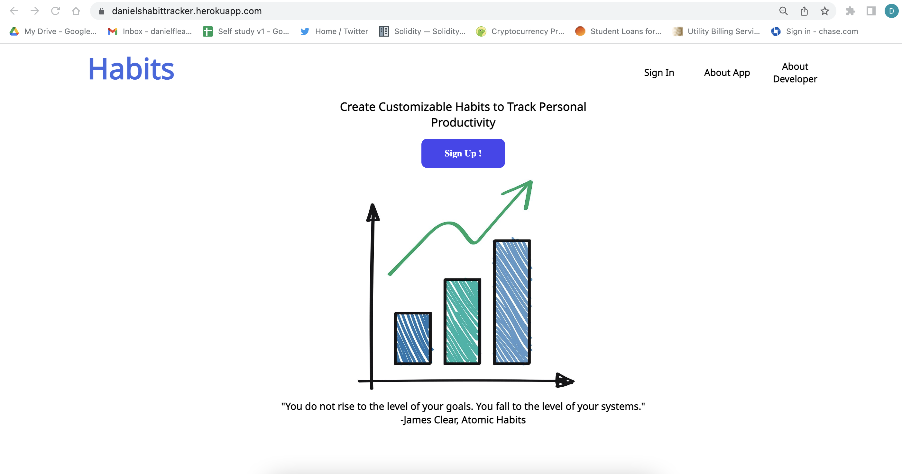
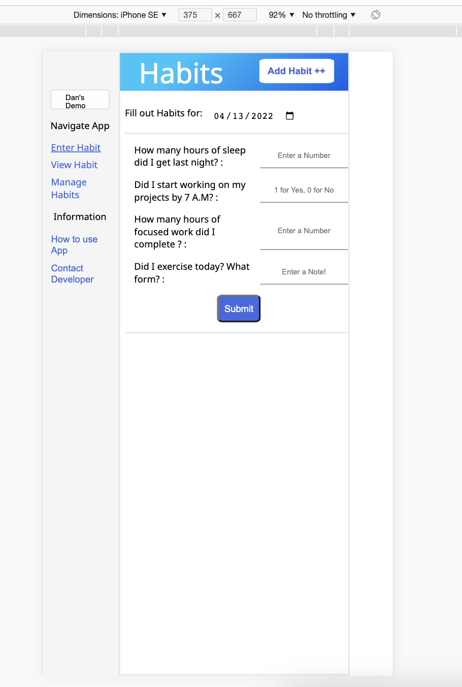
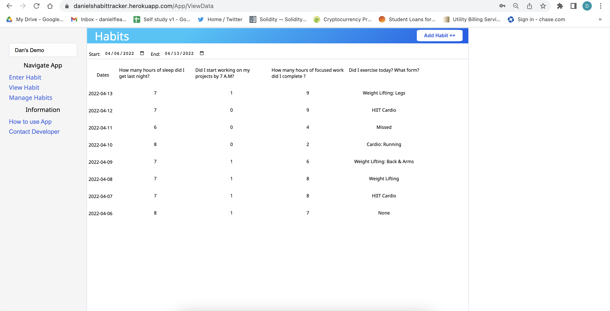

**Overview**

This application was built to track daily habits that I reflect on after each week to track my productivity  for professional and personal goals. I decided to take on this project to replace the google sheet that I currently use to track my habits.

The production version of the application can be found at https://danielshabittracker.herokuapp.com. Screenshots of the application can be found at the bottom of this README . 

To use this application, first sign up or use the demo account. Email: dandevs@gmail.com : Password: Daniel12! . Once signed into the app you can create a new habit to track by clicking the "Add Habit++" button  in the upper right hand corner. You will be prompted to name and select a tracking measure for your habit. After entering habit(s) to track, enter your daily habit data on the enter habit page. Be sure to use the date input to select the date you wish to enter data for. Data can be entered for any previous, present or future date. If you want to overwrite a specific day, resubmit the day and old data will be overwritten with the new data. To delete a habit and its data, navigate to manage habits page and click delete on the habit you want to remove. More information can be found inside the app under the "How to use App"  page.

**The repositories**
The front end of the application is in the repository: https://github.com/DanielFleace1/habitTrackerFrontEnd and the backend of the application is in the repository: https://github.com/DanielFleace1/habitTrackerAppBackEnd. I used a production build of the front end repository and copied it to the back end repository to run the production version of the application. 

**Build dependencies**

Client Side
- React
- [axios](https://axios-http.com/docs/intro)
- [Material UI](https://mui.com)

Server Side
- Node.js
- [express](https://expressjs.com/) 
- [MongoDB](https://www.mongodb.com/) 
- [bcrypt](https://www.npmjs.com/package/bcrypt) for generating password hashes.
- [jsonwebtoken](https://www.npmjs.com/package/jsonwebtoken) for authenticating users.

See package.json in each respective repository for the complete list of dependencies.
This app is deployed using [Heroku](https://devcenter.heroku.com/).
 
**To deploy a local copy**

To deploy a local copy, fork or clone the back end repository to your local machine and run npm install to install the dependencies. Configure a new [MongoDb](https://www.mongodb.com/basics/create-database). Create a .env file and set MONGODB_URI = to the connection string of mongoDB. Next in .env specify a port and proccess variable of SECRET = to any string for token verification. Use the .envExample for guidance.
Npm run dev is a script to use nodemon. During development I used the package dotenv for process variables and  [Postman](https://www.postman.com/) to test the server. 
 
The front end can be deployed by forking or cloning the front end repository and running npm install and npm start. The URL to make server requests to can be edited or specified in the pathway src/components/srcUtils/serverFunctions.js.

**Next features**

I decided to take on this project with the simple goal of creating an application that could record customizable daily habits to track and review across any date range. Currently the app is viable to do this. However, there are many features I would like to add to make the user experience more pleasant. I'd like to add data aggregation and visualizations  to the view page so that users can view data across days, weeks, months, or even years in tabular or graphical form. I'd like to add a feature so that users can easily delete data by clicking on any date in the view data page. I'd also like to add a filter on enter, view, and manage habits so that if users have a large number of habits they can filter through them quickly.

**Contact Me**
If you have any questions, concerns,  feature ideas or found bugs, please email me _Danielfleace15@gmail.com_. 

I am looking for full time and/or contract work currently. If you'd like to hire/ work with me please email me!
Thank you for taking the time to read this readme.

